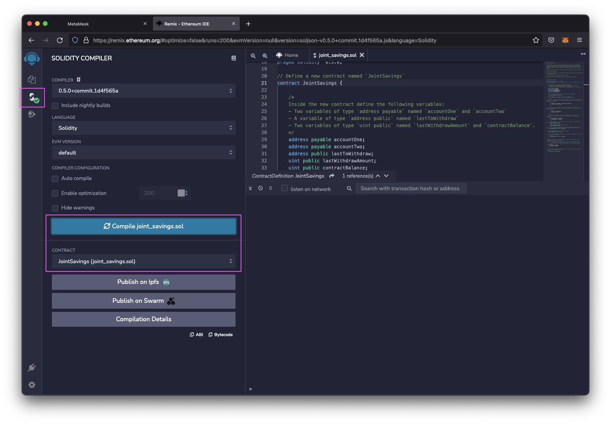
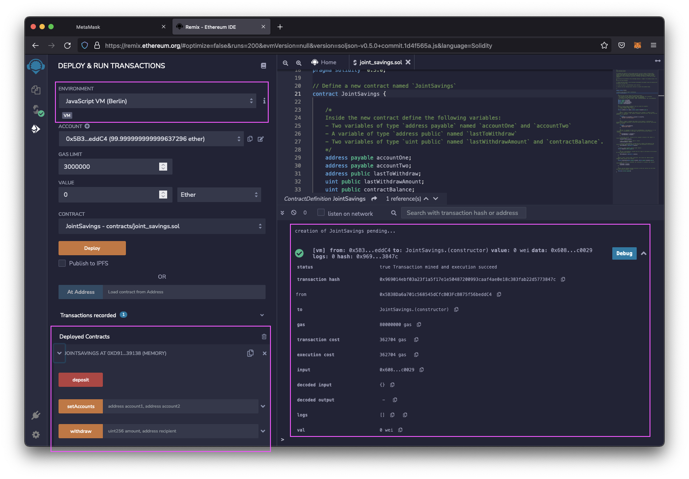
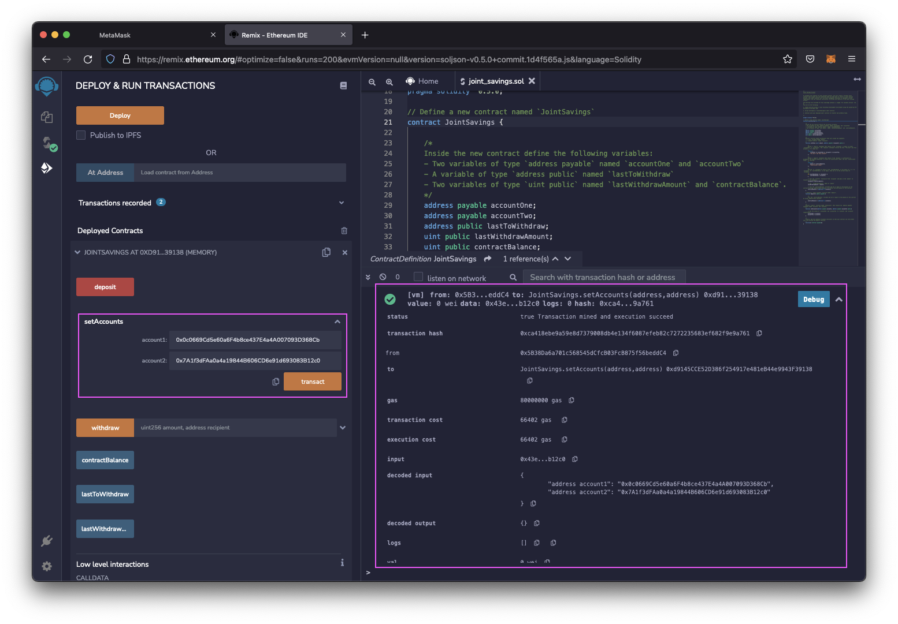
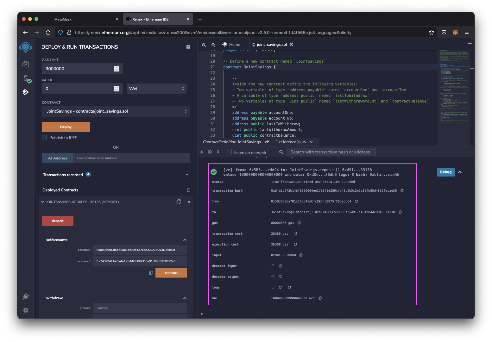
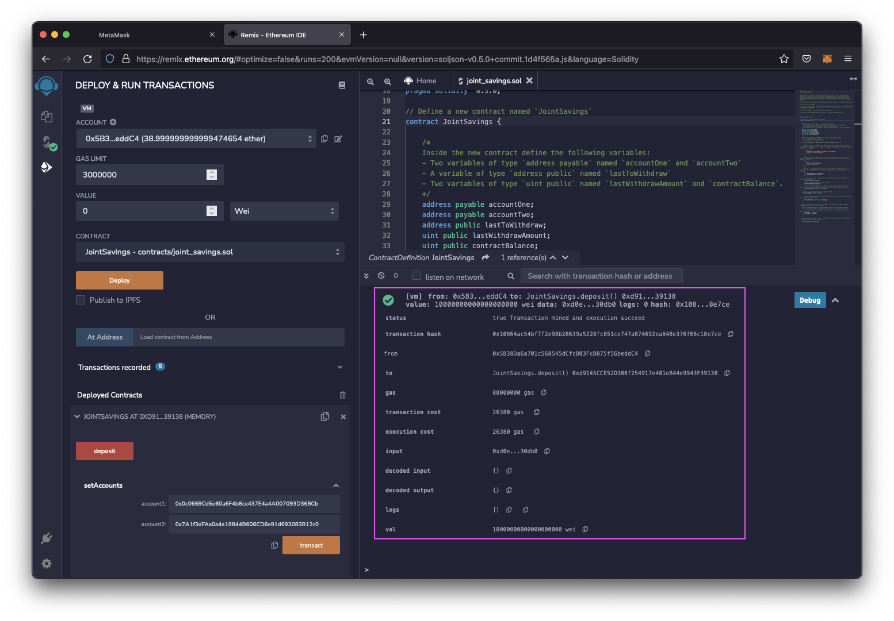
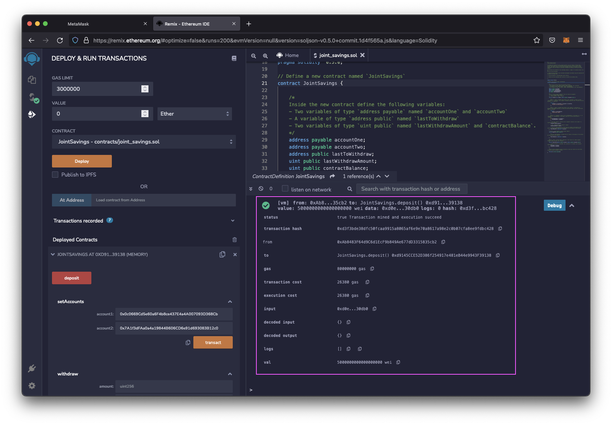
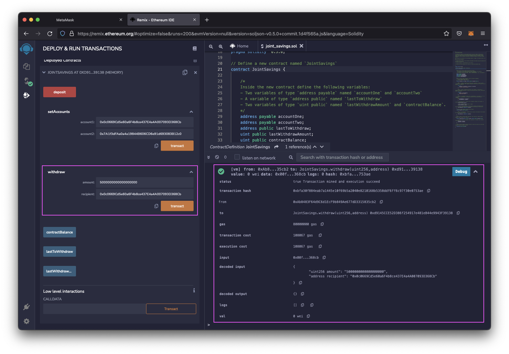
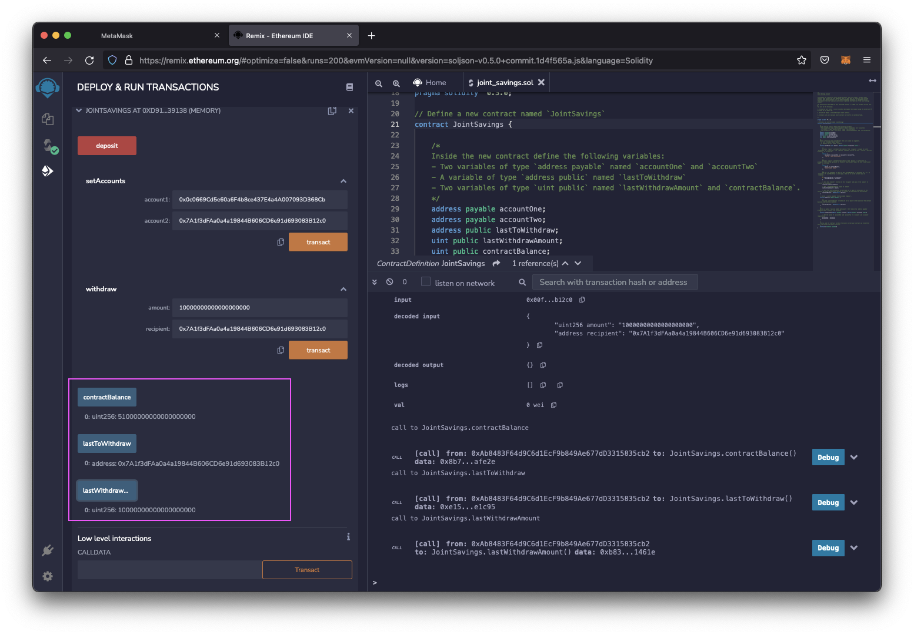
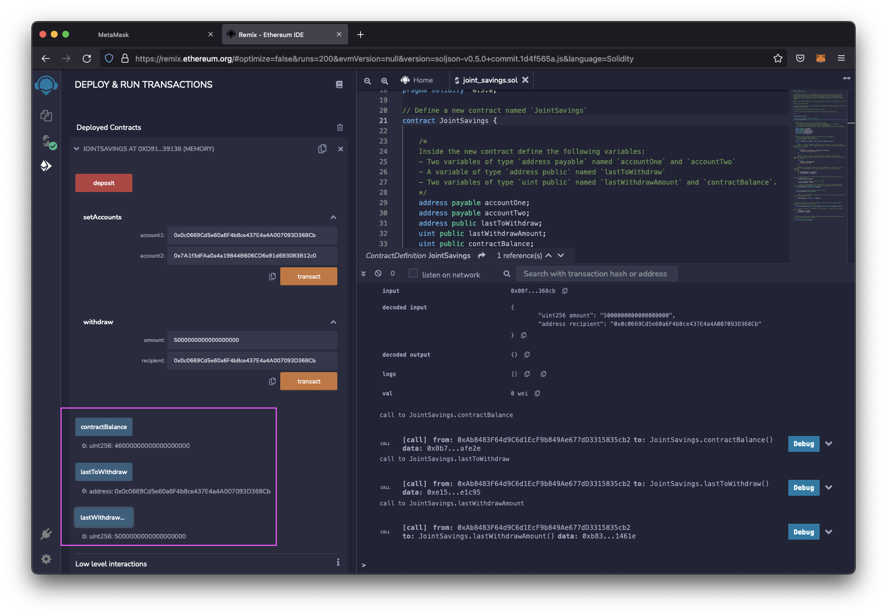

# Unit 20 - "Joint Savings Account"  

  

A Solidity smart contract that accepts two user addresses. These addresses will be able to control a joint savings account. This smart contract uses management functions to implement a financial institution’s requirements for providing the features of the joint savings account. These features will consist of the ability to deposit and withdraw funds from the account.  

### Solution

Smart contract complied successfully.  

  

Making sure that “JavaScript VM” is selected as the environment, “Deploy & Run Transactions” was applied to the Smart contract.  

  

Using the Dummy Accounts - below - the `setAccounts` function defined the authorized Ethereum address that was able to withdraw funds from deployed contract.  
* Dummy account1 address: 0x0c0669Cd5e60a6F4b8ce437E4a4A007093D368Cb  
* Dummy account2 address: 0x7A1f3dFAa0a4a19844B606CD6e91d693083B12c0  

  

Smart contract deposits were tested by sending the following amounts of ether. After each transaction, use the `contractBalance` function to verify that the funds were added to your contract:

* Transaction 1: Send 1 ether as wei
* Transaction 2: Send 10 ether as wei
* Transaction 3: Send 5 ether.

  
  
  

Having successfully deposited funds into the contract, the contract’s withdrawal functionality was test by withdrawing 5 ether into `accountOne` and 10 ether into `accountTwo`.

  
  

After each transaction, the `contractBalance` function was used to verify that the funds were withdrawn from the contract. The `lastToWithdraw` and `lastWithdrawAmount` functions to verify that the address and amount were correct.

  
  
